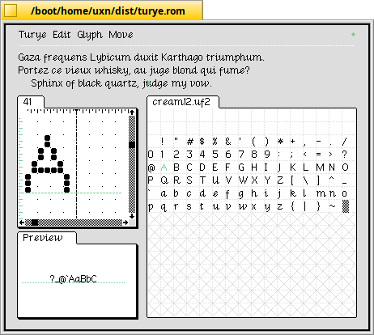

# `cream12` extractor script

This is a simple script to extract the `cream12` font from 100 Rabbits' [left](https://100r.co/site/left.html) text editor and save it in the [UF2 font format](https://wiki.xxiivv.com/site/ufx_format.html).

> This project runs on the [uxn/varvara virtual machine](https://wiki.xxiivv.com/site/varvara.html) using Felix Winkelmann's excellent [UF](http://www.call-with-current-continuation.org/uf/uf.html) Forth implementation.

## Prerequisites

- The [uxn](https://100r.co/site/uxn.html) toolchain
- [UF](http://www.call-with-current-continuation.org/uf/uf.html), version 8

## Instructions

To build `cream12.uf2`, do the following:
1. Clone this repository
1. Edit `Makefile`:
    1. Set `UFROM` to the location of `uf.rom`
    1. Set `UXNDIR` to the location of the directory containing `uxnasm`, `uxncli` and `uxnemu`.
1. Call `make` to build `cream12.uf2`.

Here is an example of what `cream12.uf2` looks like in the [turye](https://wiki.xxiivv.com/site/turye.html) font editor:

