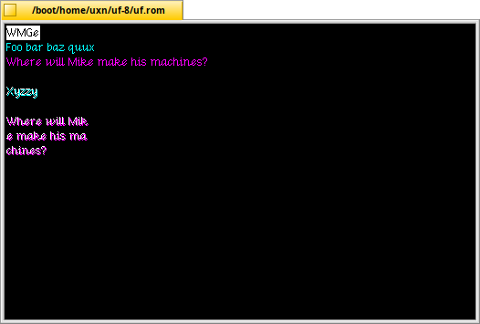

# Experiments in variable-width font rendering in uxn/UF

An attempt at rendering text using the `cream12` font extracted from 100R's [left](https://git.sr.ht/~rabbits/left) text editor.  Licensed under 0BSD as this is far from a proper library, but somebody might find this useful for other uxn/UF projects.

(You will probably need to edit paths in the Makefile if you want to run this using `make`)

> This project runs on the [uxn/varvara virtual machine](https://wiki.xxiivv.com/site/varvara.html) using Felix Winkelmann's excellent [UF](http://www.call-with-current-continuation.org/uf/uf.html) Forth implementation.

## Prerequisites

- The [uxn](https://100r.co/site/uxn.html) toolchain
- [UF](http://www.call-with-current-continuation.org/uf/uf.html), version 8
